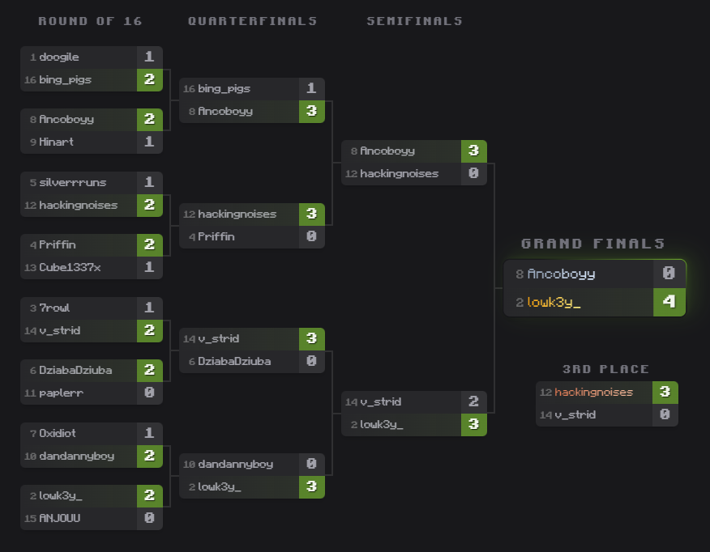

# Main Bracket (Playoffs)

The Main Bracket, also known as the **Playoffs**, will be a four-day event.  
It will follow a 1v1 single-elimination format.

## Seeding System
At the end of the season, the 12 players with the most **_phase points_** will be automatically invited and seeded 1 through 12 accordingly. Four additional players, seeded 13 through 16, will qualify through the [Last-Chance Qualifiers](./last_chance_qualifiers). Learn more about the phase point system [here](./phase_point).

Players seeded 1 through 7 will each choose their opponent from a pool of 8 players, which includes players seeded 9 through 12 and the 4 players who qualified through the [Last-Chance Qualifiers](./last_chance_qualifiers). The final unchosen player will be automatically assigned to the player seeded 8.

## Rounds
The bracket consists of four rounds. In each round, both players will play the same seed simultaneously, and the player who completes the game first will take the seed.

Match formats for each round are as follows:
- Round of 16: First to take **3** seeds (**Best of 5**)
- Quarterfinals: First to take **3** seeds (**Best of 5**)
- Semifinals: First to take **3** seeds (**Best of 5**)
- 3rd Place: First to take **3** seeds (**Best of 5**)
- Grand Finals: First to take **4** seeds (**Best of 7**)

As shown in the bracket below, all matchups after the Round of 16 are automatically determined based on the fixed structure. The bracket progresses without any further opponent selection.

## Seed Type Pick & Ban
In the bracket, players can choose from the same 5 seed types used in the MCSR Ranked Seed Filter. Players can strategically decide which seeds to play or avoid through seed type picks and bans.

For more information on the seed types, check [here](/gameplay/seed#overworld-types).

### Ban
At the beginning of each round, the lower-seeded player bans one of the 5 seed types, and the higher-seeded player bans one of the remaining 4. Banned seeds cannot be played in that match. However, in the Grand Finals, if the winner has not been determined after the 5th seed, a banned seed may be picked.

### Pick
Before starting each seed, the player who lost the previous seed will choose the next seed. The first seed of the match will be chosen by the higher-seeded player. Seeds that are banned or have already been played in the same match cannot be picked. However, in the Grand Finals, if the winner has not been determined after the 5th seed, players may pick a seed that has already been played from the previous 5 seeds.

### Summary
To summarize, the seed ban and pick process is as follows:
- Seed type ban #1: Lower-seeded player
- Seed type ban #2: Higher-seeded player
- First seed pick: Higher-seeded player
- After each seed: The player who lost the previous seed picks the next seed
  - In the Grand Finals after seed 5: All previously banned and picked seed restrictions are lifted
